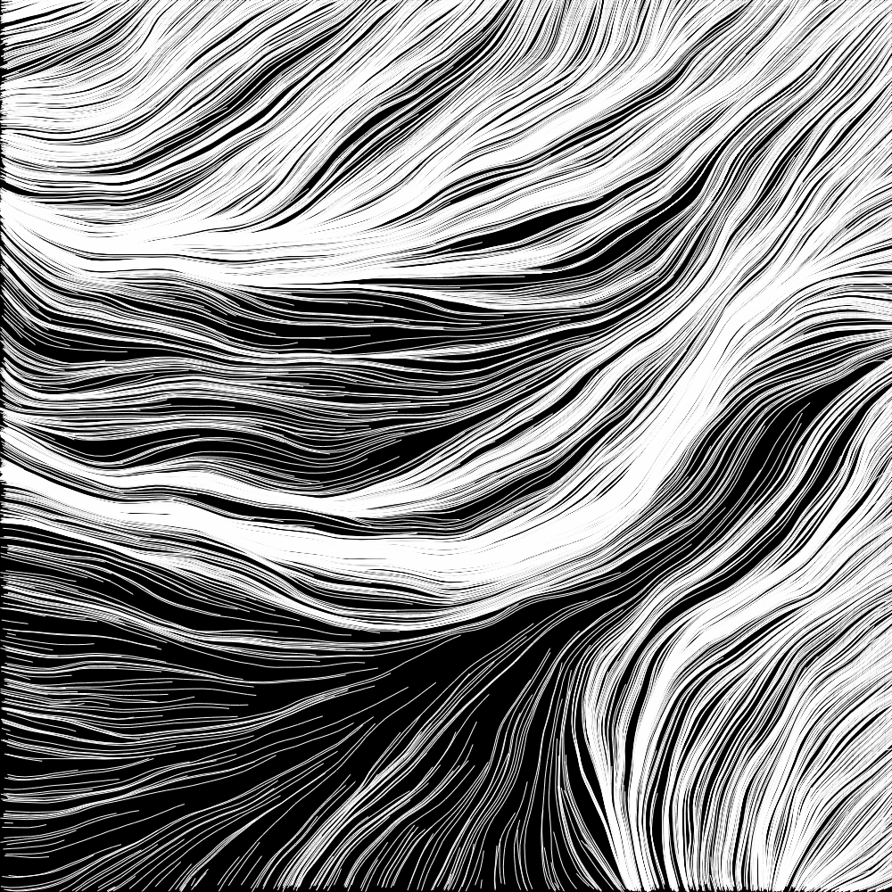

#  Readme

A Vector Flow Field generator, applying Perlin Noise

Something to keep me amused during coronavirus :)

Outputs an image of the flow, along with a json file specifying the parameters, and a .txt file that I use for sending the drawing to my plotter

Created with a lot of help from:

http://devmag.org.za/2009/04/25/perlin-noise/

WTCoreGraphicsExtensions by Wagner Truppel
https://github.com/wltrup

https://www.youtube.com/watch?v=BjoM9oKOAKY

eg:

